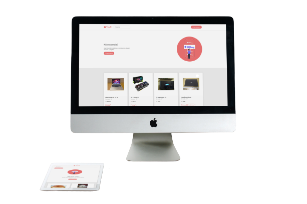

<h1 align="center">
    
</h1>

<h4 align="center">
  Teste Burh Front-End
</h4>

  

  

  

 

  

## 🔭 Burh

Esse é o meu perfil no Burh:

- [Flávio Gomes](https://burh.com.br/flaviogomes10)

## 📋 Tecnologias

Esse projeto foi desenvolvido com as seguintes tecnologias:

- [Node.js](https://nodejs.org/en/)
- [Vue.js](https://v3.vuejs.org/)
- [Sass](https://sass-lang.com/)

## 💻 Projeto

O Trasell é um projeto que visa facilitar a venda de coisas que você não usa mais, no Trasell você pode anunciar de forma rápida e fácil, com apenas alguns cliques.

## 🔖 Layout

Você pode baixar o layout do projeto no formato `.xd` através [desse link](.github/burh-project.xd).

## 📝 Licença

Esse projeto está sob a licença MIT. Veja o arquivo [LICENSE](LICENSE.md) para mais detalhes.